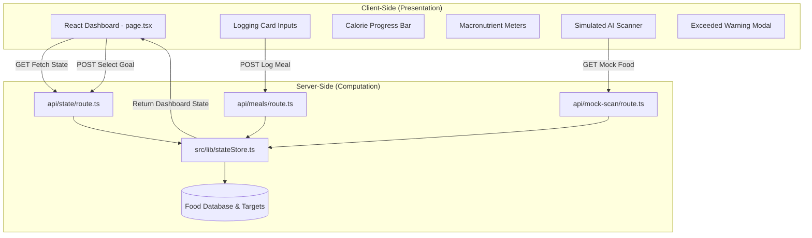

# CaloMacro: Calorie Tracker & Macro Dashboard

CaloMacro is a modern health-tracking prototype built with **Next.js App Router**, **TypeScript**, and **vanilla CSS**. The app separates presentation from data logic by using a client-side dashboard component in `src/app/page.tsx` and server-side route handlers in `src/app/api/`.

---

## 🏗️ Architectural Overview

The application is structured into a client-rendered dashboard and server-side API routes backed by an in-memory state store:



### 📁 Directory Layout
- `src/types/index.ts` - Shared TypeScript interfaces used by both client and server code.
- `src/lib/stateStore.ts` - Server-side shared state store and business logic. It holds meals, current goal, food metadata, and nutrient calculations in memory.
- `src/app/api/` - Next.js Route Handlers (`/api/state`, `/api/meals`, `/api/mock-scan`) that expose state and mutate data through standard REST-style requests.
- `src/app/globals.css` - App-wide vanilla CSS styling for the dashboard, cards, progress meters, scanner overlay, and modal controls.
- `src/app/page.tsx` - Client component that renders the dashboard, handles form input, triggers API calls, and displays live state from the server.

---

## ⚙️ Core Backend Logic & Computations

All computations occur on the server side to maintain logic integrity and scalability:

### 1. Nutrient Scaling Algorithm
When logging a meal (e.g. `200g` of `Chicken Breast`), the server looks up the food item in its catalog (which holds values per **100g**):
- **Chicken Breast**: `165 kcal, 31g protein, 0g carbs, 3.6g fat` per 100g.
- **Scaling Math**:
  $$\text{Calories} = \text{round}\left(\frac{\text{base kcal} \times \text{weight}}{100}\right) = \text{round}\left(\frac{165 \times 200}{100}\right) = 330 \text{ kcal}$$
  $$\text{Macros} = \text{round}\left(\frac{\text{base macro} \times \text{weight}}{100}\right)$$
- If the item name is not explicitly recognized, the server matches it using fuzzy/substring rules, or defaults to a standard fallback profile (`120 kcal, 5g protein, 15g carbs, 3g fat` per 100g) as a custom food placeholder.

### 2. Budget Tracking State
The server calculates running aggregates on all active meals, computes remaining targets, and yields an `exceeded: boolean` flag.
If `totals.calories > targets.calories`, the flag is set to `true`. This causes the client-side progress bar to change to **Crimson Red** with a pulsing glow, and triggers the **Daily Budget Exceeded!** warning modal.

### 3. Fitness Goal Toggle
Users can select between three goals, which dynamically shifts target limits on the server without clearing the user's current meals:
*   **Weight Loss**: `1600 kcal` | Protein: `120g` | Carbs: `150g` | Fats: `50g`
*   **Maintenance**: `2200 kcal` | Protein: `140g` | Carbs: `250g` | Fats: `70g`
*   **Muscle Gain**: `2800 kcal` | Protein: `180g` | Carbs: `320g` | Fats: `90g`

Changing goals immediately recalculates target percentages and exceeded flags in real time.

---

## 🎨 Frontend UI & Interaction Design

The frontend strictly manages presentation and triggers state requests:
*   **AI Photo Scanner**: Clicking the scanner initiates a visual scanning light overlay. The client enforces a realistic `1.2-second` scan delay to simulate image analysis before querying `/api/mock-scan` and autofilling the form inputs.
*   **Exceeded Modal**: Shows a warnings dialog prompting the user when they overeat. A transition handler ensures it only pops up when the threshold is *first* crossed.
*   **History Grid**: Renders meals in real-time. Clicking the trash button makes a `DELETE` request, updating the backend state and instantly reducing the progress meters.


---

## 🚀 Getting Started

### Prerequisites
Make sure you have Node.js (version 18 or later) installed.

### Setup and Installation
1. Install project dependencies:
   ```bash
   npm install
   ```

2. Run the local development server:
   ```bash
   npm run dev -- --webpack
   ```
   Open [http://localhost:3000](http://localhost:3000) on your browser.

   > On Windows, the project uses Webpack instead of Turbopack because native Turbopack bindings are not available for this platform.

3. To build and test production compiles:
   ```bash
   npx next build --webpack
   npm run start
   ```
